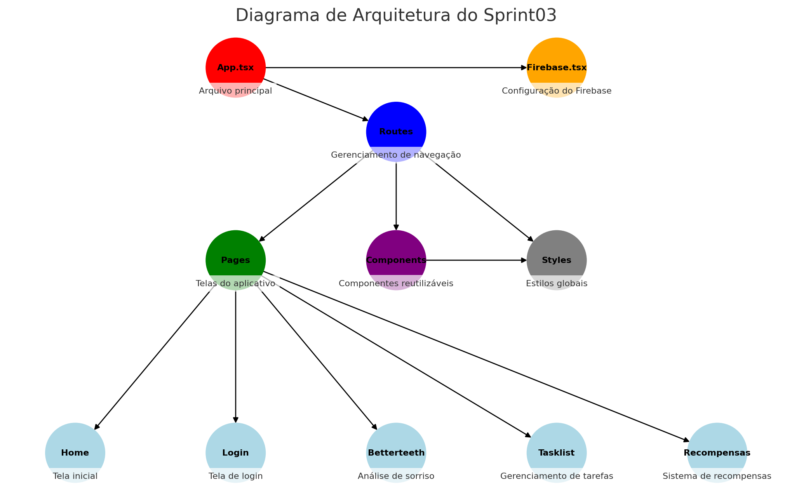

# Sprint03 - Mobile App Development

## **Descrição do Projeto**
Sprint03 é um aplicativo mobile desenvolvido para auxiliar os usuários na verificação da qualidade do sorriso, gerenciamento de tarefas diárias e obtenção de recompensas. O projeto visa oferecer uma interface intuitiva e recursos modernos para engajamento dos usuários vale lembrar que ele foi devidamente atualizado com as exigências da SPRINT04 então rode o arquivo SPRINT03/bettertooth que você encontrará todas as exigências no projeto .

## **Equipe de Desenvolvimento**
- **Murilo Ferreira Ramos** - RM553315  
- **Pedro Luiz Prado** - RM553874  
- **William Kenzo Hayashi** - RM552659  

## **Tecnologias Utilizadas**
- **React Native** - Desenvolvimento do aplicativo móvel  
- **Expo** - Framework para facilitar a execução e desenvolvimento  
- **Firebase Authentication** - Autenticação de usuários  
- **React Navigation** - Gerenciamento de navegação entre telas  
- **Styled Components / StyleSheet** - Estilização das interfaces  

## **Funcionalidades do Aplicativo**
- **Login e Autenticação** - Usuários realizam login utilizando Firebase Authentication.
- **Análise do Sorriso** - Captura e exibição da análise de qualidade do sorriso com base em imagem.
- **Gerenciamento de Tarefas** - Usuários podem visualizar e marcar tarefas diárias.
- **Recompensas** - Sistema de obtenção de recompensas após conclusão das tarefas.
- **Navegação Dinâmica** - Interface fluida para alternância entre as telas do aplicativo.

## **Diagrama de Arquitetura**


## **Estrutura de Pastas**
```
Sprint03/
│-- src/
│   │-- components/         # Componentes reutilizáveis
│   │-- pages/              # Telas do aplicativo
│   │   │-- home/           # Tela inicial
│   │   │-- login/          # Tela de login
│   │   │-- betterteeth/    # Tela de análise de sorriso
│   │   │-- tasklist/       # Tela de gerenciamento de tarefas
│   │   │-- recompensas/    # Tela de recompensas
│   │-- routes/             # Configuração de rotas e navegação
│   │-- styles/             # Estilos globais
│-- App.tsx                 # Arquivo principal do aplicativo
│-- firebase.tsx            # Configuração do Firebase
│-- package.json            # Dependências do projeto
│-- README.md               # Documentação do projeto
```

## **Instalação e Execução**
Para rodar o projeto localmente, siga os passos abaixo:

1. Clone este repositório:
```bash
   git clone https://github.com/seu-repositorio/Sprint03.git
```
2. Instale as dependências:
```bash
   cd Sprint03
   npm install
```
3. Execute o projeto:
```bash
   expo start
```
4. Para rodar no seu celular, utilize o app Expo Go e escaneie o QR Code exibido, utilize: 

```
email:gabi@gmail.com
senha: 123456 para entrar no app 
```


## **Considerações Finais**
Este projeto foi desenvolvido para a disciplina de **Mobile App Development**, atendendo aos requisitos de construção de um aplicativo funcional com pelo menos cinco telas, integração com APIs e boas práticas de desenvolvimento.
